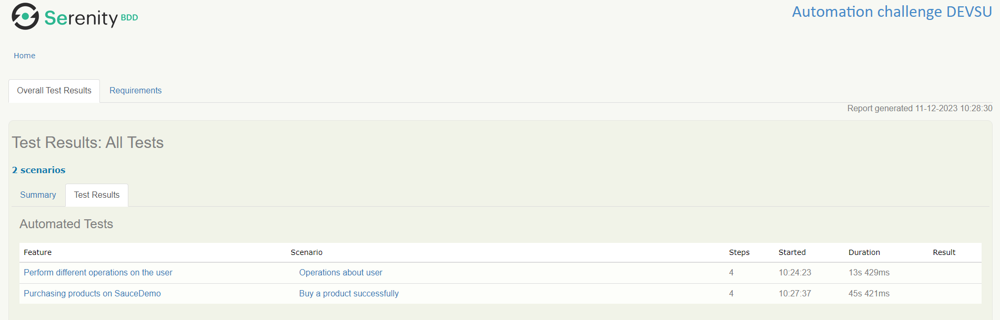
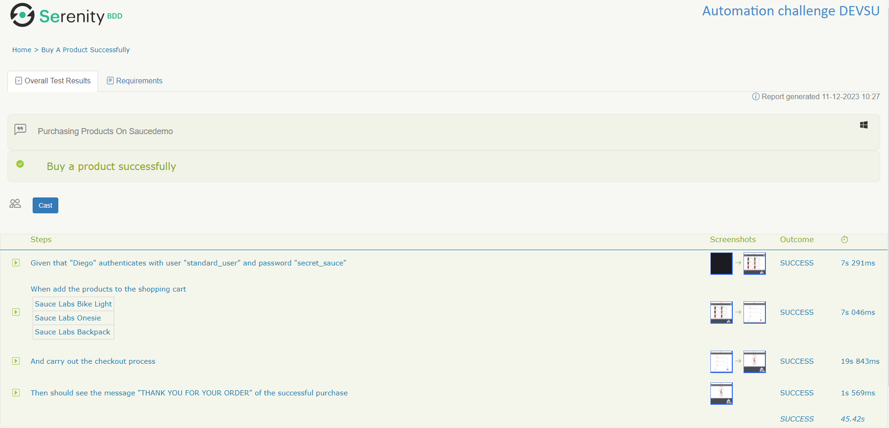
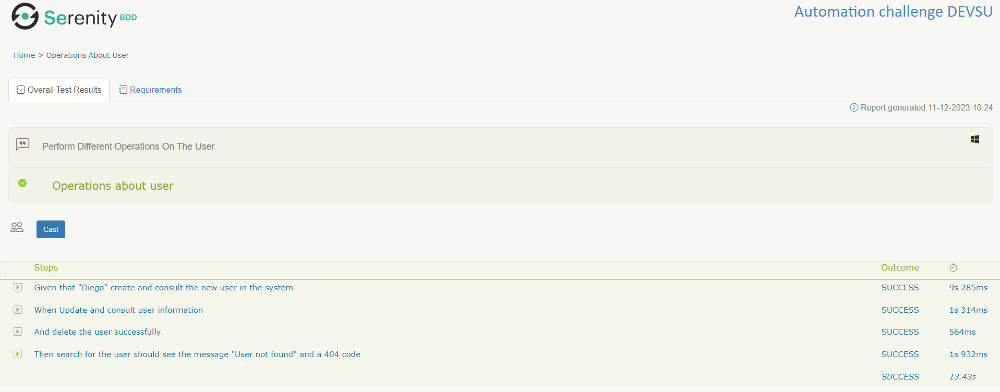

# CHALLENGE DEVSU (WEB - API)

## AUTOMATION E2E
### Implemented Tools:
* Serenity BDD
* Selenium
* Cucumber
* JUnit
* Lombok

### Design pattern: 
* Screenplay-BDD

### Programming language:
* Java

### Dependency manager:
* Gradle

### Exercise:
**Description:**

* Realizar una prueba funcional automatizada (Prueba E2E) de un flujo de compra en la página [saucedemo](https://www.saucedemo.com/):

**Steps:**
1. Autenticarse con el usuario: standard_user y password: secret_sauce
2. Agregar dos productos al carrito
3. Visualizar el carrito
4. Completar el formulario de compra
5. Finalizar la compra hasta la confirmación: “THANK YOU FOR YOUR ORDER”

### Build and Run
* You can Run the **"BuyProductsRunner"** class or execute the command by console "gradle clean test aggregate -i"
* When the execution is finished enter the **"target/site/serenity"** folder and open the file index.html for to look the report of Serenity

---

## AUTOMATION API
### Implemented Tools:
* Serenity BDD
* Serenity Rest
* Cucumber
* JUnit
* Lombok

### Design pattern:
* Screenplay-BDD

### Programming language:
* Java

### Dependency manager:
* Gradle

### Exercise:
**Description:**

* La página [petstore](https://petstore.swagger.io/) proporciona la documentación sobre apis de una **“PetStore”**.

**Steps:**
1. Crear un usuario [createUser](https://petstore.swagger.io/#/user/createUser)
2. Buscar el usuario creado [getUserByName](https://petstore.swagger.io/#/user/getUserByName)
3. Actualizar el nombre y el correo del usuario [updateUser](https://petstore.swagger.io/#/user/updateUser)
4. Buscar el usuario actualizado - [getUserByName](https://petstore.swagger.io/#/user/getUserByName)
5. Eliminar el usuario - [deleteUser](https://petstore.swagger.io/#/user/deleteUser)

### Build and Run
* You can Run the **"UserOperationsRunner"** class or execute the command by console "gradle clean test aggregate -i"
* When the execution is finished enter the **"target/site/serenity"** folder and open the file index.html for to look the report of Serenity

---

## Pre-Conditions:
* Have the [JDK](https://www.oracle.com/co/java/technologies/javase/javase8-archive-downloads.html) Java Development Kit at least version 1.8
* Have [GRADLE](https://gradle.org/releases/) configured for project build.
* Given that the automation runs in different browsers, it is required to have installed [Chrome](https://www.google.com/intl/es_es/chrome/), [Firefox](https://www.mozilla.org/es-ES/firefox/new/) , [Edge](https://www.microsoft.com/es-es/edge?form=MA13FJ)
* Clone the project from its **main** branch by running the following command:
`git clone https://github.com/dfmerchan2/challenge-devsu.git`

## Evidence Execution

## Autor 🤖

* Diego Fernando Merchan Jimenez
    